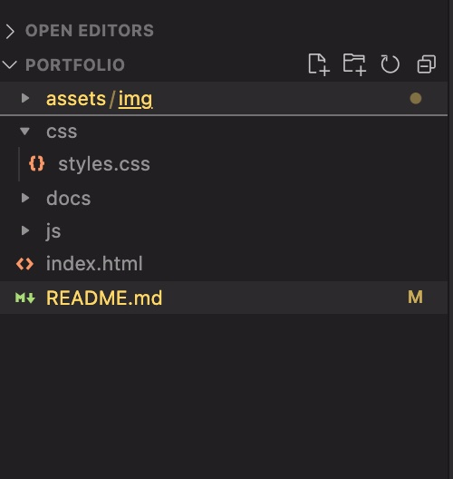
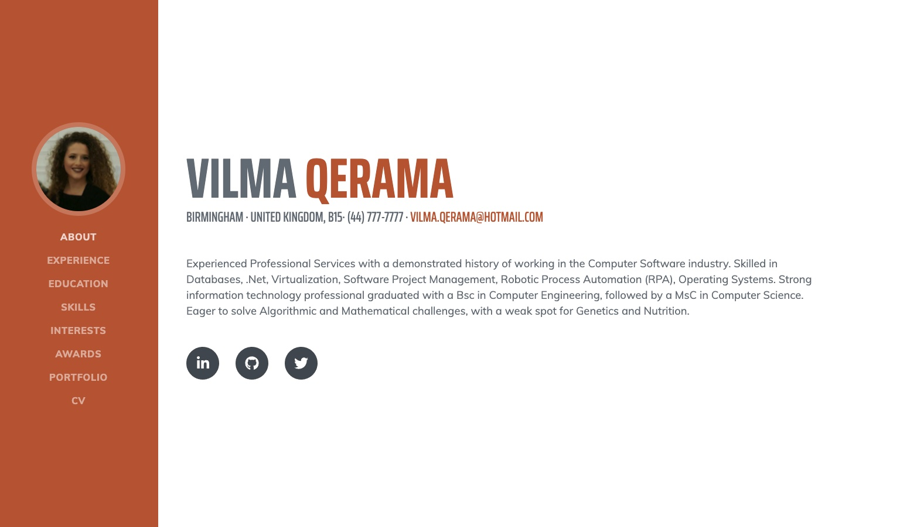
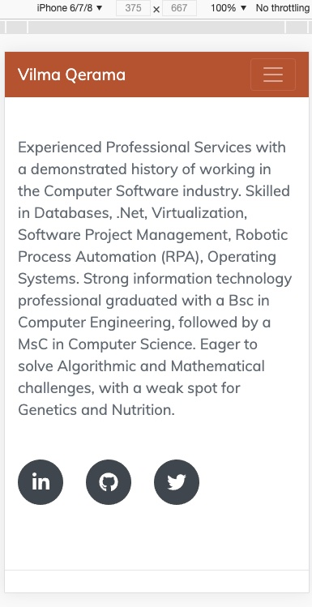

# Portfolio Website

## Technologies Used

- HTML
- CSS
- Bootstrap
- Javascript

## Directory organisation

Following an image from my directory structure:

## Website Organisation

1. The website is divided in two main parts: 1. navbar and 2. the main content and these two parts are included in a container.
   This structure has been applied to make it easier to invoke media queries for the whole container, so to adapt it for tablets and mobiles.
2. the Navbar is set to be vertical and style has been applied to it. It contains links to the main content section and it points the user to the selected section.

3. The main content is composed of 3 sections:

   - About
   - Experience
   - Education
   - Skills
   - Interests
   - Awards
   - Portfolio
   - CV - where from my CV ca be downloaded in pdf format

4. In addition

   - pseudo selectors are used to increase the size of the images when hovering over
   - each project has a respective image with respective titles and alt properties.
   - clicking on the projects redirects you to the respective github page or repository

   'Contact' Section is in the presentation part - although not added as a physical sections, social and professional media have been added as a contacting mean.

5. My full name is present at the top of the website

6. Semantic HTML and comments are used to make the code more readable for colleagues.

# Printscreen of the website from a Desktop

# Printscreen of the website from a mobile perspective

