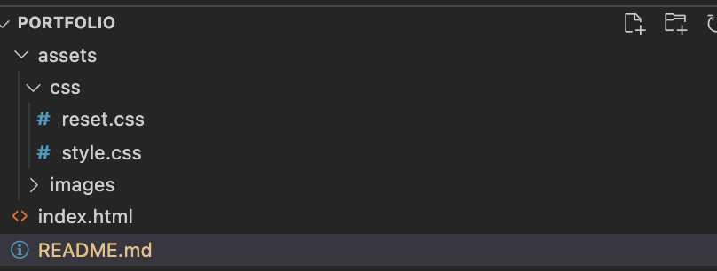

# My first Portfolio built using HTML & CSS

## Directory organisation

Following an image from my directory structure:

## Website Organisation

1. The website is divided in two main parts: 1. navbar and 2. the main content and these two parts are included in a container.
   This structure has been applied to make it easier to invoke media queries for the whole container, so to adapt it for tablets and mobiles.
2. the Navbar is set to be vertical and style has been applied to it. It contains links to the main content section and it points the user to the selected section.

3. The main content is composed of 3 sections:

   - About me
   - Projects
   - Contact
     The 3 sections are organised in flexboxes so to make wrapping easier when the scren size changes.

   'About' Section contains two flexboxes: 1 for the my profile image and one flaxbox for the about me info. The image is clickable and sends you to my LinkedIn profile

   'Projects' Section contains three main flexboxes: one for each project.

   - as requested the first project image is bigger than the other images
   - pseudo selectors are used to increase the size of the images when hovering over
   - each project has a respective image with respective titles and alt properties.
   - clicking on the projects redirects you to the respective github page or repository

   'Contact' Section is another flaxbox with a form in it.

4. My full name is present at the top of the website and animation has been applied to the title, subtitle and to the Logo. The respective animations can be found from row 231 in the stylesheet.

5. Semantic HTML and comments are used to make the code more readable for colleagues.

# Printscreen of the website from a Desktop

# Printscreen of the website from a mobile perspective

Note: I am still working to make the background stretch properly

Plan: create a scrollable vertical navbar
